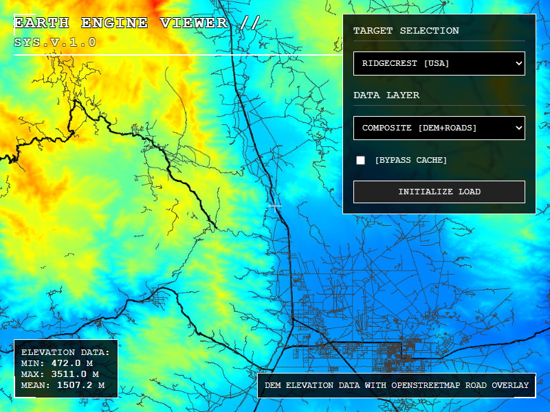

# Earth Engine Layers Viewer

A web application that visualizes Google Earth Engine data layers with a video game HUD-style interface. Built with Bun, TypeScript, and vanilla JavaScript.



## Features

- Interactive HUD-style interface
- Display Digital Elevation Models (DEM)
- Display OpenStreetMap road data
- Composite DEM + Roads visualization
- Multiple region presets (Mount Fuji, Grand Canyon, Ridgecrest CA)
- Elevation statistics display
- Caching system for faster loading

## Prerequisites

- [Bun](https://bun.sh) (v1.0 or later)
- Google Earth Engine service account credentials

## Installation

1. Install dependencies:
```bash
bun install
```

2. Set up Earth Engine credentials:
   - Obtain a service account key from [Google Earth Engine](https://earthengine.google.com/)
   - Save the key as `earthengine.json` in the project root
   - The key should contain:
     - `client_email`: Your service account email
     - `private_key`: Your private key
     - Other standard service account fields

## Running the Application

### Development Server

Start the development server:
```bash
bun run dev
```

The application will be available at `http://localhost:3000`

### Testing

Run the Puppeteer tests:
```bash
bun run test.ts
```

## Project Structure

```
earthengine/
├── src/
│   ├── index.ts              # Bun server with API routes and bundling
│   ├── client/
│   │   ├── index.html        # Main HTML file
│   │   ├── main.ts           # Client-side TypeScript (bundled by Bun)
│   │   └── styles.css        # HUD styles
│   └── server/
│       └── earthengine_service.ts  # Earth Engine API integration
├── public/                   # Static assets and cached images
├── earthengine.json         # Earth Engine credentials (gitignored)
└── test.ts                  # Puppeteer tests
```

## Architecture

- **Runtime**: Bun (replaces Node.js)
- **Server**: Bun.serve (replaces Express)
- **Bundler**: Bun's native bundler (replaces Vite)
- **On-the-fly Compilation**: TypeScript to JavaScript bundling happens automatically
- **API**: RESTful endpoints for Earth Engine data
- **Caching**: File-based caching for Earth Engine responses
